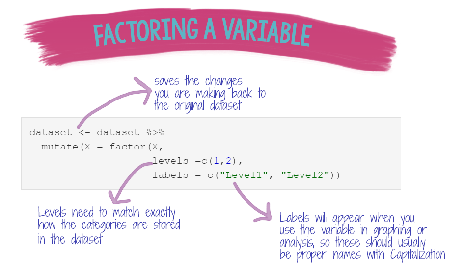
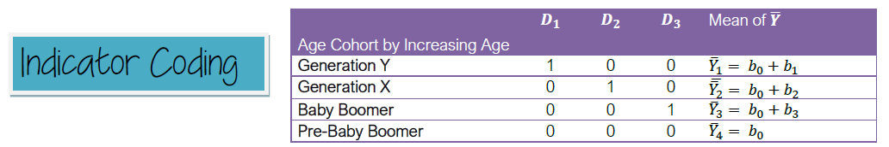

```{r setup, include=FALSE}
library(learnr)
library(tidyverse)
library(fontawesome)
library(car)
library(carData)

knitr::opts_chunk$set(echo = FALSE)

#data for exercises
X<-rep(c("A","B", "C"), 20)
Y<-rep(c("cantaloupe","banana", "apple"), 20)
Z<-rep(c("cantaloupe","banana", "apple"), 20)
dataset1 <- haven::read_sav("data/sample_dataset.sav")
data(GSSvocab)

x = rbinom(n = 10, 
           size = 1, 
           prob = .5)
```

## Introduction

<br>

`r fa("fas fa-chalkboard-teacher", fill = "purple")`**LEARNING OBJECTIVES**

::: {.tip}
The **objectives** of this tutorial are:

-   Understand what a categorical variable is and how R uses categorical variables in analyses
-   Understand the different coding schemes that can be used to code categorical variables and how those coding schemes relate to the interpretation of regression coefficients
:::

------------------------------------------------------------------------

`r fa("fab fa-r-project", fill = "purple")` **GOALS**: In this tutorial, you will learn how to:

-   Factor variables using the `factor` and `haven::as_factor` functions
-   Use functions in the `forcats` packages to manipulate categorical variables
-   Convert factor variables back to numeric or character variables

------------------------------------------------------------------------

`r fa("fas fa-box-open", fill = "purple")` **PACKAGES** Several packages have been preloaded for this tutorial:

-   `tidyverse`
-   `ggplot2`
-   `forcats`
-   `haven`

## Categorical Variables

Categorical variables are variables that provide information about the discrete membership of a case in one of a finite number of categories. Categorical variables are qualitative variables because there is no inherent numeric value to any of the categories that make up a particular variable.

Categorical variables can be further broken down into three different types: nominal, ordinal, and binary.

```{r, echo=FALSE, out.width="75%", fig.align = "center"}
knitr::include_graphics("images/nominal_ordinal_binary.png")  
```

**Nominal** variables are categorical variables where there is no relationship between the different levels of the variable.

**Ordinal** variables are categorical variables where there is an increasing or decreasing relationship between levels of the variable. However, the distance between levels is still qualitative. The best example of an ordinal level variable is Place in a race (e.g., 1st, 2nd, 3rd, etc.)

**Binary** variables have only two levels. Binary variables are usually used to denote whether or not a particular outcome or even has happened (1= yes, 0 = no), although there are other possible ways in which a variable may be binary.

## Factors in R

In a raw dataset, categorical variables may be stored as numeric (e.g., 0 = male, 1 = female), or character(text) format (e.g., "male", "female"). Numeric categorical variables can be analyzed like any other numeric variable in R, but character variables cannot. The process of telling R that a variable should be treated as categorical is called **FACTORING**. Assigning numeric values allows us to include categorical variables in statistical analyses.

The benefit of factoring variables in R is that if R knows a variable is a factor, it will incorporate it into a statistical model with the appropriate numeric coding (e.g., dummy coding, effects coding) and the correct degrees of freedom. You can convert both character and numeric type variables to factors. In programs like SPSS, you often have to create the numeric coding schemes for categorical variables manually. Factoring also makes it easier to plot by a grouping variable in packages like `ggplot2`.

#### `Factor` function

When you tell R a variable is categorical, R will assign each level of the variable a consecutive number beginning with 1. In the code below, the variable 'X' has three levels, "A", "B", and "C". When the variable is factored, the levels of the variable become "A", "B", and "C", and each letter is assigned a numeric value of 1, 2, and 3, respectively.

In the example below, `X` is a character variable containing "A", "B" and "C" values.

```{r str-categorical, echo=T}
str(X)
```

After `X` is factored, when we apply the `str` function to the variable, we can see that it is now a factor with 3 levels.

```{r X-factored, echo = T}

X = factor(X)
str(X)
```

R always assigns integers to levels in alphabetical order. In the example above, A =1, B=2, C=3.

In the example below, `apple` will be assigned 1, `banana` = 2, and cantaloupe = 3.

```{r}
str(Y)
```

```{r}
Y <- factor(Y)
str(Y)
```

By default, R always sorts levels in alphabetical order. However, you can tell R how you would like the levels ordered. Variable `Z` in the example below is identical to `Y`. But this time, we will add `levels()` to the `factor` call to tell R how to code the levels of the variable. We want "banana" assigned first, then "apple", and then "cantaloupe".

```{r}
Z <- factor(Z, levels = c("banana", "apple", "cantaloupe"))
str(Z)
```

If you want to double-check the factor coding, you can use the `mapLevels` function in the `gdata` package.

```{r}
gdata::mapLevels(X)
gdata::mapLevels(Y)
gdata::mapLevels(Z)
```

In the examples above, we were working with single variables, but most of the time you will be working with variables that are already stored in a dataframe. If you need to factor a variable in a dataset, you can use the pipe, `%>%` along with the `mutate` and `factor` functions to factor your variables.

As mentioned above, R will automatically order your variables alphabetically, but we can override that by setting the levels ourselves. You can also set labels for your levels, and those labels can be anything you want them to be. If labels are provided for a factor variable, those labels will show up when you plot using `ggplot2`.

**`r fa("fas fa-laptop-code", fill = "teal")` Example Code**

```{r, echo=FALSE, out.width="75%", fig.align = "center"}
  
```

In the code chunk above, we are using the `dataset` and saving our changes back to the original dataset (`dataset <- dataset`). Then (`%>%`) we are using the `mutate` function to modify a variable called `X` variable using the `factor` function.

Within the `factor` function, we need to tell R what the `levels` of our variable are, and how those levels should be labeled when they appear in graphs or in model results (`labels = c("label1", "label2"))`. Our `X` variable has two levels, coded numerically as 1 and 2 in the original dataset. You can modify this code depending on the number of levels of your categorical variable.

------------------------------------------------------------------------

#### `haven::as_factor` function

Although R has certainly grown in popularity over the past decade, many researchers in Rehabilitation Sciences are still using Excel and SPSS for data analysis. It is likely that you will be working with SPSS datasets at some point in time. SPSS has a number of useful data management features, including variable labels and value labels for categorical variables. Data from SPSS can be imported into R using the `haven` package (`read_sav()`). When SPSS data is imported with `haven`, the variable and value labels that were saved in the dataset are pulled into R. However, you still need to tell R which variables are categorical after you import the data.

```{r, echo=FALSE, out.width="75%", fig.align = "center"}
knitr::include_graphics("images/spssdata.png")  
```

`haven` has a function called `as_factor` that will convert variables to factors and apply the SPSS value labels to the levels of the variable. Try out the code below to see how `haven` factors the variables automatically.

**`r fa("fas fa-laptop-code", fill = "teal")` Example Code**

```{r, haven-example, exercise=TRUE}
dataset1 <- dataset1 %>%
  dplyr::mutate(Gender = haven::as_factor(Gender))

summary(dataset1$Gender)
```

```{r, haven-2}
dataset1 <- dataset1 %>%
  dplyr::mutate(Gender = haven::as_factor(Gender))
```

**`r fa("fas fa-laptop-code", fill = "teal")` Coding Exercise**

Using the code above as a model, factor the `Race` and `Hispanic` variables.

```{r haven-factor-exer, exercise = TRUE, exercise.setup = "haven-2"}

```

```{r haven-factor-exer-solution}
dataset1 <- dataset1 %>%
  dplyr::mutate(Race = haven::as_factor(Race),
                Hispanic = haven::as_factor(Hispanic))

summary(dataset1)
```

## Coding Schemes for Categorical Variables

#### Dummy Coding

The default coding scheme for categorical variables in R is "treatment" coding, which is another name for dummy coding (also called "indicator coding". With dummy coding, one group is set as the reference group, or the group that all of the other groups are compared against. A dummy variable is then created to represent a comparison between each group and the reference group. The total number of dummy variables created will be equal to the number of levels of the variable minus 1 (*k* - 1).

Darlington and Hayes (2017) provide an example of dummy coding using a 4-category variable for Generation. The table below demonstrates the treatment/indicator/dummy coding scheme for this variable:

```{r, echo=FALSE, out.width="75%", fig.align = "center"}
  
```

<br> <br>

#### Effect Coding

With effect coding, the reference group is assigned values of -1 for each of the dummy variables.

```{r, echo=FALSE, out.width="75%", fig.align = "center"}
knitr::include_graphics("images/effect.png")  
```

#### Helmert Coding

```{r, echo=FALSE, out.width="75%", fig.align = "center"}
knitr::include_graphics("images/helmert.png")  
```

From page 277-28 of Darlington, R. B., & Hayes, A. (2017). Regression analysis and linear models: Concepts, applications, and implementation. Guilford Press: NY.

## Forcats Package

The `forcats` package is one of the core packages contained in the `tidyverse`. Remember the `tidyverse` is a set of packages designed to optimize workflow and organization when coding in R.

There are cheatsheets available for most of the major packages in the tidyverse that contain helpful tips and instructions for using functions in the package. To access the cheatsheet for `forcats` click here.

<https://raw.githubusercontent.com/rstudio/cheatsheets/master/factors.pdf>

There is also good documentation for the package here: <https://forcats.tidyverse.org/>

The functions I'll show you how to use in this tutorial are:

-   **fct_count**: provides a descriptive table for factors
-   **fct_recode**: changes the coding of values in a factor
-   **fct_lump**: lumps multiple smaller levels into a single other category
-   **fct_collapse**: allows the user to collapse factor levels into defined groups
-   **fct_relevel**: reorder factors by hand

To demonstrate how to use functions in the `forcats` package, we will use the `GSSvocab` dataset from the `carData` package. The `GSSvocab` dataset has 8 variables (5 factors, 3 numeric) and contains data from an observational study, including demographics and scores on a 10-item vocabulary test.

The dataset has been preloaded for the code and exercises below and the data from the first six cases are shown below:

```{r}
head(GSSvocab)
```

### `fct_count`

<br>

The `fct_count` function will provide a table of frequencies for each level of a factor variable. Additionally, you can ask for the levels to be sorted (`sort = T`), and ask for the proportion of the total for each level (`prop=TRUE`).

**`r fa("fas fa-laptop-code", fill = "teal")` Coding Example**

```{r fct-count, echo=TRUE}
GSSvocab %>%
  pull(year) %>% 
  forcats::fct_count(sort= T, prop=T)
```

<br>

**`r fa("fas fa-laptop-code", fill = "teal")` Coding Exercise** Using the code above as an example, use `fct_count` to examine the variable `ageGroup` (do not sort or ask for proportional info)

```{r fctcount_exercise, exercise=TRUE}

```

```{r fctcount_exercise-solution}
GSSvocab %>%
  pull(ageGroup) %>% 
  forcats::fct_count()
```

### `fct_recode`

The `fct_recode` function allows you to rename the levels of a factor. This can be helpful for setting up the labels of a categorical variable for use in tables or graphs.  

Here are the levels of the `educGroup` variable:

```{r}
levels(GSSvocab$educGroup)
```

There are 5 levels to the variable relating to the number of years in school, from \<12 years to \>16 years. Completing 12 years of school usually means you have a high school diploma, while completing more than 16 years means that you have at least attended some graduate school. We can therefore use this information to recode (rename) the levels of the `educGroup` variable.

**`r fa("fas fa-laptop-code", fill = "teal")` Coding Example**

```{r fctrecode-example, echo=TRUE}
GSSvocab <-GSSvocab %>%
  dplyr::mutate(educGroup = forcats::fct_recode(educGroup, 
                                         "Did not finish HS" = "<12 yrs",
                                         "HS diploma" = "12 yrs",
                                         "Some college" = "13-15 yrs",
                                         "College degree" = "16 yrs",
                                         "Graduate school" = ">16 yrs"))
GSSvocab %>%
  pull(educGroup) %>%
  forcats::fct_count()
```
## `fct_lump`

The `fct_lump` functions allows you to combine levels of categorical variable based on frequency, number of groups desired, or porportion of cases.  There are several `lump` functions you can use:


-  `fct_lump_min()`: lumps levels that appear fewer than min times.

-  `fct_lump_prop()`: lumps levels that appear in fewer prop * n times

-  `fct_lump_n()` lumps all levels except for the n most frequent (or least frequent if n < 0)


<br>

**`r fa("fas fa-laptop-code", fill = "teal")` Coding Examples**

To demonstrate the `fct_lump` functions, we can use the `year` variable from the `GSSvocab` dataset we have been working with.  This variable has 20 levels.  Let's collapse any level that has less than 1200 cases. All of the cases with less than 1200 cases will be re-categorized into an "other" category.  


#### `fct_lump_min()`
How many levels do we get for the `year` variable when we collapse all the levels that have less than 1200 cases? How many cases are in the "Other" category?

```{r fct-lump-min, echo=TRUE}
GSSvocab %>%
  pull(year) %>%
  forcats::fct_lump_min( min = 1200) %>%
  table()
```

#### `fct_lump_prop`
The `fct_lump_prop` function is similar to the `_min` function except now it will collapse cases based on a proportion of total cases instead of a minimum value.  

```{r fct-lump-prop, echo=TRUE}
GSSvocab %>%
  pull(year) %>%
  forcats::fct_lump_prop(prop = .05) %>%
  table()
```

#### `fct_lump_n()` 

`fct_lump_n()` lumps all levels except for the n most frequent (or least frequent if n < 0).  Here, we will lump into the 5 most frequent levels, and all other cases will be categorized as "Other".

```{r fct-lump-n, echo=T}
GSSvocab %>%
  pull(year) %>%
  forcats::fct_lump_n(n=5) %>%
  table()
```


## Converting Factors back to Numeric Variables

When you convert variables to factors in R, R assigns numeric values of 1, 2, 3, ... n to the levels of the factor, alongside the factor component. That means when you convert it back to a numeric variable, those numeric values will be applied during the conversion to numeric.   This is true even if you originally started with a numeric variable that had different numeric codes.  Let's see this in action.  We'll create a numeric variable (0-1) and convert it to a factor.  Then we will convert it back to numeric and take a look at the values stored in the variable.

First, we will create a binomial variable (0/1) and save is as "x": 
```{r create-variable, echo=T}
x = rbinom(n = 10, 
           size = 1, 
           prob = .5)
x
```

Then we will factor the variable so that 0 = "no" and 1 = "yes".  

```{r factor-x, echo=T}
x <- factor(x, levels = c(0,1), labels = c("no", "yes"))
x
```

Now, we will convert it back to numeric and see what happens.

```{r convert-numeric, echo=T}
x <- factor(x, levels = c(0,1), labels = c("no", "yes"))
x <- as.numeric(x)
x
```

As you can see, when we convert it back to numeric, the values are 1/2, not 0/1.  Sometimes, this may be okay and won't impact your analyses. However, if you need to get the variable back to the original 0/1 structure, you have a couple of options.  One is to reload the original dataset, over-writing any changes you've made (this may or may not be a terrible idea). If you loaded your original dataset but have saved all of your changes to a new version of that dataset, you could just copy over the original variable in its 0/1 form into the dataset you have been working with.  Alternatively, you could just write a bit of code and rescore the 1/2 back to 0/1.  That is what has been done below.

```{r rescore, echo=T}
x <- factor(x, levels = c(0,1), labels = c("no", "yes"))
x <- as.numeric(x)

x <- ifelse(x==1,0,1)  #if x=1, then it gets changed to 0, if not, it gets coded as 1
x
```


