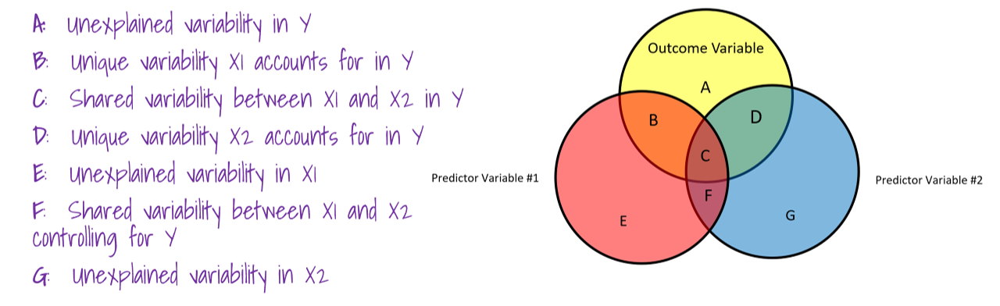

```{r setup, include=FALSE}
library(readr)
library(Hmisc)
library(car)
library(dplyr)
library(psych)
library(ggplot2)
library(learnr)
library(fontawesome)
library(ppcor)

knitr::opts_chunk$set(echo = FALSE)
 
#load exam dataset
exam.data <- read_csv("exam_anxiety.csv")

#load exam dataset that has gender removed
exam.data2 <- exam.data %>%
  dplyr::select(-Gender)

#load the liar dataset
liar <- read_csv("liar.csv")

```

## 1. Introduction

```{r, echo=FALSE, out.width="75%", fig.align = "center"}
knitr::include_graphics("images/correlation_comic.png")  
```

`r fa("fas fa-chalkboard-teacher", fill = "purple")`**LEARNING OBJECTIVES**

The **objectives** of this tutorial are:

-   Define and interpret Pearson's bivariate correlation coefficient
-   Understand and describe the factors that influence correlations
-   Define the Coefficient of Determination

------------------------------------------------------------------------

`r fa("fab fa-r-project", fill = "purple")` **GOALS**: In this tutorial, you will learn how to:

-   use `cor()`, `rcorr()`, `cor.test()` and `chart.Correlation` functions to run bivariate correlation analyses
-   use `cor()`, `rcorr()`, `cor.test()` functions to run non-parametric correlations (Spearman, Kendall)
-   use `pcor()` and `spcor()` to run partial and semi-partial correlations

------------------------------------------------------------------------

`r fa("fas fa-box-open", fill = "purple")` **PACKAGES** Several packages have been preloaded for this tutorial:

-   `tidyverse`
-   `readr`
-   `psych`
-   `dplyr`
-   `cor`
-   `Hmisc`
-   `car`
-   `ggplot2`
-   `ppcor` 

### About the Tutorial

Each tutorial has a number of learning objectives and R Goals that will be presented in the introduction.

`r fa("fas fa-laptop-code", fill= "purple")` **CODING HELP** To help you keep track of functions and their corresponding packages, we will use a package call `::` for each function in coding examples. The exception to this is when using the package `ggplot2`, or when using the pipe operator `%>%` which is loaded as part of the `tidyverse` and `magrittr` packages. If no package is listed for a function, you can assume it is part of Base R. A list of all the packages that will be used during the tutorial will also be provided in the introduction to each tutorial under the **PACKAGES** Section. If you are practicing what you are learning in an R Script or .RMD file, you can load these packages in your first code chunk.

**CODING EXAMPLES** occur throughout the tutorials and appear in code chunk gray boxes, similar to how they appear when working in an RMarkdown document (RMD file). Sometimes output will also appear below the code chunk.

```{r example-code-chunk, echo=T}
#coding examples will appear in gray boxes; output below

2+2 
3+2
sqrt(2+2)
```

**INTERACTIVE CODING EXAMPLES** are included throughout the tutorial. You may be asked to write, modify, or run code for these examples. Hints and solutions are provided. Here is an example of interactive coding:

```{r interactive-coding-example, exercise = T}

2+3 #run R as a calculator

pratice <- 3 + 2   #save the results to an object

practice  #print the results
```

`r fa("fab fa-r-project", fill="purple")` **REVIEW EXERCISES** R Review Exercises are indicated with the `r fa("fab fa-r-project", fill="purple")` **REVIEW** Icon. These are optional exercises you can do to practice the R skills you learned last semester.

## 2. What is a Correlation?

Correlation is an analytic method for assessing the relationship between two variables.

-   **Provides description of relationship**

    -   "Taller men have bigger feet"

-   **Suggests an inference to be made from one variable from another**

    -   "If someone has big footprints, he is probably tall"

------------------------------------------------------------------------

The strength of a Correlation is represented by the *r* statistic.

-   *\*\*r* can range from -1 to 1\*\*

    -   1 (or -1) reflects a perfect relationship between two variables

    -   0 reflects no relationship between two variables

-   ***r* can be positive (+) or negative (-)**

    -   A positive correlation means that as one variable increases, the other also increases

    -   A negative correlation means that as one variable increases, the other decreases

-   **We interpret a correlation coefficient in the units that the variables were measured in. A *r* = 0.65 means that for a one unit increase in X, there is a 0.65 unit increase in Y.**

***

```{r, echo=FALSE, out.width="50%", fig.align = "center"}
  
```

***


### 2.1 What is *r* conceptually?

The correlation coefficient represents the standardized covariability of X and Y. What??? Let's take a look at the formula for the correlation coefficient to get a better understanding of what *r* represents.

```{r, echo=FALSE, out.width="100%", fig.align = "center"}
  
```

Essentially, a correlation coefficient represents the extent to which X and Y vary together, divided by the extent to which the vary separately. Why not just examine the covariability of X and Y? The covariance is dependent on the units of measurement of X and Y. For example, the covariance of two variables measured in miles might be 4.25, but if the same scores are converted to kilometers, the covariance is 11.

If we standardize the covariance--by dividing by the standard deviation (well, really the product of the SDs of X and Y), then it is easier to interpret.


### 2.2 Coefficient of Determination

::: {.tip}
**QUESTION** Is a correlation of .50 twice as big as a correlation of .25?
:::

To answer the question above, we need to consider the coefficient of determination, also known as $R^2$. If we square the correlation coefficient *r*, we get the percentage of variability that X accounts for in Y.

-   For an *r* = .50, the $R^2$ = .25 , so 25% of variability of Y is accounted for by X
-   For an *r* = .25, the $R^2$ = .062, so 6.2% of the variability of Y is accounted for by X

***

### 2.3 The Dataset: Field's Exam Anxiety Data

For an initial introduction to calculating correlations in R, we will use the `exam_anxiety` dataset that is described in the Andy Field textbook. A psychologist was interested in the relationship between exam stress (anxiety) and revision on exam performance. State anxiety was measured on a 0-100 scale, revision was measured in hours (spent revising), and exam grade was the percentage grade students received on the exam.

The dataset `exam.data` has been preloaded into the environment. We'll use `head()` to take a quick peek at the dataset.

```{r dataset-peek, echo=T}

head(exam.data)

```

Next we will use `summary` and `psych::describe` to take a look at some descriptive statistics for the dataset.

```{r summary, echo=T}
summary(exam.data)
```

```{r describe, echo=T}
print(psych::describe(exam.data))
```

We have 5 variables in the dataset--ID, Revise, Exam, Anxiety, and Gender. When you run correlations in R, all of the variables you want to correlate need to be in numeric format. Hopefully you've noticed that the `Gender` variable is a character variable. If we want to include gender in our correlation matrix, we would need to convert it to a numeric variable first. However, for this tutorial, we are only interested in the correlations between `exam`, `anxiety` and `revise`.

Let's also take a look at some histograms and boxplots for our three variables of interest: Revise, Exam, and Anxiety.

```{r histograms-and-boxplots}

hist(exam.data$Revise)
hist(exam.data$Exam, breaks=15)
hist(exam.data$Anxiety)

boxplot(exam.data$Revise,exam.data$Exam,exam.data$Anxiety, names = c("Revise", "Exam", "Anxiety"), col = c("red", "blue", "green"))
```

Now that we have taken a look at the data, we can move to the next step of the analysis: visualizing the correlations.  

::: {.tip}
**QUESTION** What did you observe when looking at the histograms and boxplots?
:::
------------------------------------------------------------------------

### `r fa("fab fa-r-project", fill = "teal")` REVIEW!

It may have been a while since you have worked in R, so the next two optional exercises are designed to help you get back into the swing of things!

::: {.tip}
**QUESTION** What is one method you could use to temporarily remove `Gender` from the dataset?
:::


##### Optional Exercise 2.1

Write code to save a new dataset without `Gender` included. Use `head()` to confirm you have removed `Gender`. (*Note*: Nothing will happen when you save the new dataset. Using `head()`allows you to see if your code worked the way you wanted).

```{r remove-gender, exercise=TRUE, exercise.eval=T}

```

```{r remove-gender-solution}
exam.data2 <- exam.data %>%
  dplyr::select(-Gender)
head(exam.data2)
```


##### Optional Exercise 2.2

::: {.tip}
**QUESTION** How can you make the `Gender` variable a numeric variable instead of a character variable?
:::

Write code to convert `Gender` to a numeric variable. (Click the "hint" button to get a hint and the solution).

```{r gender-numeric, exercise=TRUE}

```

```{r gender-numeric-hint}

"Convert Gender to a factor variable first"

```

```{r gender-numeric-solution}

exam.data <- exam.data %>%
  mutate(Gender = as.factor(Gender),
         Gender = as.numeric(Gender))

```


## 3. Visualizing Correlations

Running and interpreting correlations should not be done without examining a graphical representation of the relationship. A scatterplot presents a visual representation of the relationship between two variables--usually a predictor variable (X-axis) and an outcome variable (Y-axis).

### 3.1 Scatterplots

Base R has a `plot` function that will create a scatterplot. The format is `plot(x, y)`:

**`r fa("fas fa-laptop-code", fill = "teal")` Example Code**
```{r base_r_scatterplot, echo=T}
#base R scatterplot
plot(exam.data$Anxiety, exam.data$Exam) 
```

### 3.2 Line of Best Fit

Often with scatterplots, we want to see the "line of best fit." The "line of best fit" is exactly that--the line that bests fits the data. The line of best fit is the line that overall, minimizes the distance between each of the points and the line. To add the line to a Base R scatterplot, we need to use the `abline` and `lm` functions. You can see how to do this in the code chunk below.

*Run the code in the chunk below to add the line to the plot.*

**`r fa("fas fa-laptop-code", fill = "teal")` Practice Code**
```{r scatterplot-abline, exercise=TRUE}

plot(exam.data$Anxiety, exam.data$Exam) 
abline(lm(Exam~Anxiety, data=exam.data))   #adds the regression line
```

### 3.3 Using `ggplot2` for scatterplots

To get an even better looking plot, we can turn to our favorite R graphics package, `ggplot2.` To graph a scatterplot, you will need to use `geom_point`. If you want to include the line of best fit, you can add `geom_smooth(method = "lm")`. By default, `ggplot2` will plot the 95% confidence interval when using `method="lm"`. If you want to turn this off, you can set `se = 0`.

*Play around with the code below to add and remove the line of best fit, as well as the turn on and off the 95% CI. Click on the HINT button if you need help.*

**`r fa("fas fa-laptop-code", fill = "teal")` Practice Code**
```{r ggplot-scatterplot, exercise=TRUE}

#Exam with Anxiety
plot1 <- ggplot(exam.data, aes(x=Anxiety, y = Exam)) +
  geom_point() 
plot1
```

```{r ggplot-scatterplot-hint}

#to add the line of best fit
plot1 <- ggplot(exam.data, aes(x=Anxiety, y = Exam)) +
  geom_point() + 
  geom_smooth(method = "lm")

```

```{r ggplot-scatterplot-solution}

#to remove the 95% CI 
plot1 <- ggplot(exam.data, aes(x=Anxiety, y = Exam)) +
  geom_point() + 
  geom_smooth(method = "lm",se = 0)

```

### `r fa("fas fa-laptop-code", fill = "teal")` Coding Exercises: Creating Scatterplots

##### Exercise 3.1 

Using `ggplot2`, create a scatterplot of the relationship between exam scores and revise.

```{r ggplot-exam-revise, exercise = TRUE}

```

```{r ggplot-exam-revise-solution}

plot2 <- ggplot(exam.data, aes(x=Revise, y = Exam)) +
  geom_point() + 
  geom_smooth(method="lm", se = 0)
plot2

```

## 4. Running Correlations in R

The Field textbook describes three different functions that can be used to get correlation coefficients-- `cor()`, `cor.test()`, and `rcorr()`. Each of these functions has strengths and weaknesses. Some can calculate parametric and non-parametric correlations, some give p-values, and one gives confidence intervals.

Which function (or functions) you use will depend on your overall analysis goals. For example, if you are checking assumptions or relationship between variables before running analysis (as we did with repeated measures ANOVAs), the correlation coefficient itself is important, not the p-value. If you are reporting a correlation matrix in a manuscript, reviewers will likely want to have some information about the p-values associated with the correlations (but are they important??).

The table below summarizes what each of these functions can do. In the exercises below, you'll run code using each of the functions. You'll also be introduced to one more correlation function, `chart.Correlation`.

<center>
{width="50%"}
</center>
### 4.1 Method 1: `cor()`

The first method for calculating correlations is to use the `cor()` function in Base R. We'll first create a subset of the data to remove `Gender`. Then we'll use the `cor()` function to run the correlations.

**`r fa("fas fa-laptop-code", fill = "teal")` Practice Code**
```{r correlation-method1, exercise = TRUE}

#subsetting the data first
exam.data2 <- subset(exam.data, select=c(Revise, Exam, Anxiety))

#running the correlation
cor(exam.data2, use = "pairwise.complete.obs", method="pearson")
```

With the `cor()` function, we get a matrix of the correlations between all possible pairs of variables in the dataset. Along the diagonal, the correlations are equal to 1.00 because they represent the correlation between the variable and itself.

### 4.2 Method 2: `rcorr()`

Another method to calculate correlations is to use the `rcorr` function from the `Hmisc` package. In the example below, the `%>%` and the `select` function are used to remove the gender variable from the correlation calculation first. Then the data are converted to a matrix format, which is required for `rcorr`.

Note that we could have used the subsetted dataset we created earlier when running with `cor()`. This is just another example of how you can feed the dataset into the function using the `%>%`.

**`r fa("fas fa-laptop-code", fill = "teal")` Practice Code**
```{r rcor-example, exercise = TRUE}
exam.data %>%
  dplyr::select(Exam, Anxiety, Revise) %>%
  as.matrix() %>%
  Hmisc::rcorr(type="pearson")
```

The output for `rcor` are two tables--the first containing the correlation coefficients and the 2nd table contains the corresponding p-values.

### 4.3 Method 3: `cor.test()`

To run the correlations with `cor.test()`, we'll need to feed pairs of variables into the function. Use the `$` to select each variable, and set the method to "pearson" to get the Pearson bivariate correlation coefficient for the pair of variables.

**`r fa("fas fa-laptop-code", fill = "teal")` Practice Code**
```{r cortest-example, exercise = TRUE}
cor.test(exam.data$Exam, exam.data$Anxiety, method = "pearson")
```

The output for `cor.test` includes a t-test with its p-value, the 95% confidence itnerval for the correlation, and the pearson correlation coefficient. Note

### 4.4 Method 4: `chart.Correlation`

The package `PerformanceAnalytics` contains a great function for running and visualizing correlations. The package has been pre-loaded here (but we'll still use the `::` with the package name as a reminder).

**`r fa("fas fa-laptop-code", fill = "teal")` Practice Code**
```{r chartcorrelations, exercise = TRUE}
exam.data %>%
  dplyr::select(Exam, Anxiety, Revise) %>%
  PerformanceAnalytics::chart.Correlation()
```

Pretty cool, right? The diagonal contains the histograms of each of the variables included. The correlation coefficients are found above the diagonal and are starred to indicate statistical significance. Below the diagonal are the corresponding scatterplots for each of the pairs of variables.

## 5. Non-Parametric Correlations

The code for running non-parametric correlations is very similar to code for pearson's r. It is just a matter of setting the `method` or `type` (depending on the functioning you are using) to Spearman or Kendall, `method = "spearman"`. Remember that these types of correlations are appropriate when you have data that do not meet the assumptions of a parametric test, i.e., ranked data.


#### `r fa("fas fa-laptop-code", fill = "teal")`Coding Exercises: Non-Parametric Correlations

Andy Field's `liar` dataset has been preloaded. The dataset is designed to answer the question of whether people who are creative are better liars. The two variables we are interested in are `Creativity` (score on a creativity questionnaire) and `Position` (what place they came in during a Biggest Liar competition).

Here is a glimpse of the data:
```{r liar-data}
head(liar)
```

##### Exercise 5.1

Calculate a Spearman's Rho for the relationship between position and creativity. Modify the code below.  Check the solution if you have any trouble.

```{r spearman, exercise = TRUE}
cor.test(liar$Position, liar$Creativity, method = )
```

```{r spearman-solution}
cor.test(liar$Position, liar$Creativity, method = "spearman" )
```

##### Exercise 5.2

Calculate a Kendall's Tau for the relationship between position and creativity.

```{r kendall, exercise = TRUE}

```

```{r kendall-solution}
cor.test(liar$Position, liar$Creativity, method = "kendall" )
```


## 6. Partial and Semi-Partial Correlations
In this section, two new types of correlations are introduced: partial correlations, and semi-partial correlations.

-   A **Partial correlation** $pr^2$ measures the relationship between two variables, controlling for the effect that a third variable has on them both.

-   A **Semi-partial correlation** $spr^2$ measures the relationship between two variables controlling for the effect that a third variable has on only one of the others.

The best way to begin to understand the difference between these two correlations is to see them graphically.  The figure below contains two predictor variables (X1 and X2), and one outcome variable (Y). Each variable is represented by a circle that signifies the variability associated with that variable.  Each piece of variability in the figure has been labeled with a letter.  We can use these letters individually and in combination to better understand the relationships between the three variables.  In the next sections, we'll break down the partial and semi-partial correlations a bit more.   


```{r, echo=FALSE, out.width="100%", fig.align = "center"}
  
```

Remember that $R^2$ represents the total variability that the IVs account for in the DV.  In this example, $$R^2 = \frac{B + C + D}{A + B + C + D}$$


### 6.1  Partial correlation (squared) *$pr^2$*

A partial correlation is a correlation between two variables with the effects of other variables taken into account ("controlled for"). It is the amount of variability in the outcome that a predictor variable shares relative to the amount in the outcome variable that is left after the contributions of the other predictor variables have been removed from both that of the predictor and the outcome.  The effects of other variables are "partialed out".  Squared partial correlation is expressed as $pr^2$. 


Using the Venn Diagram above, the partial correlation between X1 and Y is equal to:
$${pr^2}_{1} = \frac{B }{A + B}$$

The partial correlation between X2 and Y is equal to:
$${pr^2}_{2} = \frac{D }{C + D}$$


### 6.2  Semi-partial correlation $sr^2$

Semi-partial correlation is when the effect of a variable is removed from one of the variables but not both variables in the correlation.  It is equal to the proportion of variability account for by one predictor but not with any other predictors.  

```{r, echo=FALSE, out.width="100%", fig.align = "center"}
  
```


The semi-partial correlation between X1 and Y is:
$${sr^2}_{1} = \frac{B}{A+ B+ C + D}$$

The semi-partial correlation between X2 and Y is:
$${sr^2}_{2} = \frac{D }{A+ B+ C + D}$$


### 6.3 Calculating Partial and Semi-Partial Correlations in R

To calculate the partial and semi-partial correlations in R, install the `ppcor` package.  We can then use the `exam.data2` dataset we created earlier to run partial and semi-partial correlations on the three variables in the dataset.  Practice running the correlations using the code exercises below.  

**`r fa("fas fa-laptop-code", fill = "teal")` Practice Code**
```{r partial-correlation, exercise = TRUE}

ppcor::pcor(exam.data2, method="pearson")

```

**`r fa("fas fa-laptop-code", fill = "teal")` Practice Code**
```{r semipartial-correlation, exercise = TRUE}

ppcor::spcor(exam.data2, method = "pearson")

```
