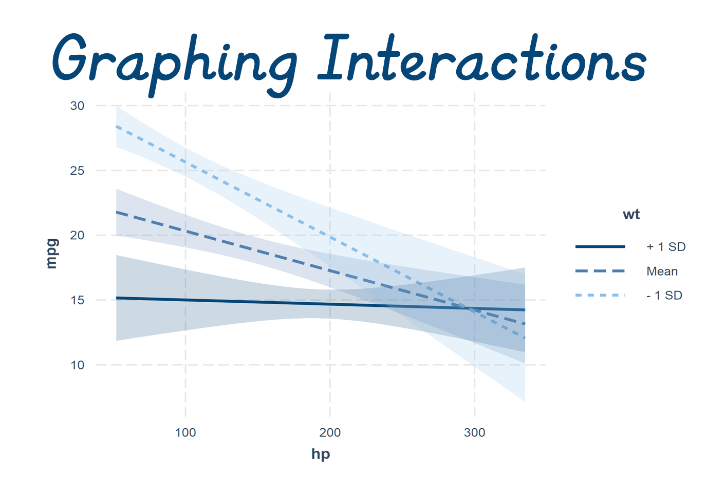

```{r setup, include=FALSE}
library(learnr)
library(haven)
library(ggplot2)
library(tidyverse)
library(effects)
library(readxl)
library(fontawesome)
library(interactions)

knitr::opts_chunk$set(echo = FALSE, warning = FALSE, message = FALSE)

cleanup = theme(panel.grid.major = element_blank(), 
                panel.grid.minor = element_blank(), 
                panel.background = element_blank(), 
                axis.line.x = element_line(color = "black"),
                axis.line.y = element_line(color = "black"),
                legend.key = element_rect(fill = "white"),
                text = element_text(size = 12))

#data for binary moderator example
NELS <- haven::read_sav("data/NELS_short.sav")
NELS <- NELS %>%
  mutate(zf1cncpt2 = scale(f1cncpt2),
         S_ESTEEM = ((zf1cncpt2*10) + 50),
         female = as_factor(sex))

NELS_short <- NELS %>%
  select(bytests,female,S_ESTEEM) %>%
  na.omit()

NELS_short <- NELS_short %>%
  mutate(Ach_Cent = scale(bytests, scale=F, center = T))

model.2  <- lm(S_ESTEEM ~ Ach_Cent*female, data = NELS_short)


#Data for Example 2 continuous by continuous
#load the dataset
ex2data <- read_xls("data/keith tv ability.xls")

#center the predictor and moderator
ex2data <- ex2data %>%
  mutate(TV_cent = scale(TV, scale=FALSE),
         ABILITY_cent = scale(ABILITY, scale=FALSE))

ex2.model.1 <- lm(ACHIEVE~ SES + ABILITY_cent + TV_cent, data=ex2data)
ex2.model.2 <- lm(ACHIEVE~ SES + ABILITY_cent*TV_cent, data=ex2data)
```

```{r, echo=FALSE, out.width="75%", fig.align = "center"}
  
```


## Categorical Versus Continuous Interaction
To demonstrate how to graph an interaction involving a continuous predictor and a categorical (dichotomous) moderator, we'll use an example from Chapter 7 of the Keith book. This example uses data from the NELS dataset which has been loaded for this tutorial.

The question we are seeking to answer with a moderation analysis is:

*Is the relationship between self-esteem and achievement the same for 10th grade boys and girls?*

To answer this question, we can use a hierarchical regression model. As a preliminary step, missing data has been removed from the dataset, `S_ESTEEM` has been converted to a T-score (*M* = 50, *SD* = 10),  `achievement` has been mean-centered (now called `Ach_Cent`), and `sex` has been dummy coded into a new variable (`female` where female = 1, male = 0).

##### **`r fa("fas fa-laptop-code", fill = "teal")` Coding Exercise**

Run the code below to see the results of the regression models.  

```{r regression-model, exercise = TRUE}

#step 1
model.1 <- lm(S_ESTEEM ~ Ach_Cent + female, data = NELS_short)
summary(model.1)

#step 2
model.2  <- lm(S_ESTEEM ~ Ach_Cent*female, data = NELS_short)
summary(model.2)

#step 3
anova(model.1, model.2)
```

The interaction in the model above is not statistically significant, *p* = .27. This suggests the effect of achievement on self-esteem is the same for boys and girls. Although not significant, we can graph the interaction to better visualize what is going on for each group.

#### Step 1:  "Pick-a-Point" for Continuous Variables

In this example, we are working with one binary and one continuous variable. The easiest way to graph a binary x continuous interaction is to graph separate lines for the dichotomous variable. That means the continuous variable will need to go on the X-axis.  We'll need to pick several points on the X-axis to plot. One of the most common sets of points to pick is the Mean (average value), 1 SD above the mean (high value), and 1 SD below the mean (low value).  You do not have to pick those values though--pick values that make sense and will allow you to see the moderated relationships at a range of values.  

To graph at 1 SD above and below the mean, we will need to know the standard deviation for `Ach_Cent`.  We can use the `sd()` function to get that value:

```{r sd-achievement, echo=TRUE}
sd(NELS_short$Ach_Cent)
```

The SD for `Ach_Cent` is 8.77.  Because the variable is mean centered the mean = 0, so the three values we will plot at are -8.77, 0, and 8.77.  Using the `effects` package and our saved model results, we can use the `effect` function to calculate the predicted values for `S_ESTEEM` for men and women at each of these levels of the moderator.  

Note that in the code below, we do not have to set values for `female`. The `effect` function will recognize that the variable is dichotomous and will calculate predicted values for both levels of the variable, at each level of `Ach_Cent`. 

After we create the predicted values, we will need to convert the results to a dataframe.  

```{r predicted-values, echo=TRUE}

#calculate the predicted values for a set of values of x (here, 1 SD above and below the mean because we centered)
model.1.pred <- effect('Ach_Cent*female', model.2,
                                          xlevels=list(Ach_Cent= c(-8.77, 0, 8.77)),
                                          se=TRUE, confidence.level=.95, typical=mean)

#Put data in data frame 
model.1.pred<-as.data.frame(model.1.pred)
```

#### Step 2:  Factor the Moderator

In Step 1, we calculated predicted scores for three different values of `Ach_Cent`.  In order to make graphing with `ggplot2` a bit easier, we now need to factor the variable. We will label the levels "high", "average", and "low".

```{r factoring, echo=TRUE}
#Create factors of the interaction variables 
model.1.pred <- model.1.pred %>%
  mutate(Ach_Cent = factor(Ach_Cent, 
                                 levels = c(-8.77, 0, 8.77),
                                 labels = c("Low", "Average", "High")))
```

##### **`r fa("fas fa-laptop-code", fill = "teal")` Coding Exercise**

Write and run code below that shows you the full dataframe for `model.1.pred`.  

```{r show-dataframe, exercise = TRUE}

```

```{r show-dataframe-solution}

model.1.pred

```


#### Step 3: Use `ggplot2` to Plot the Interaction

The last step is to graph the interaction using `ggplot2`.  Remember the data we are using for graphing is not the original dataset. Instead, it is the set of predicted values we saved above as `model.1.pred`.  

We will put `Ach_Cent` on the X-axis, `fit` on the Y-axis, and assign lines to `female` (`group = female`). 


##### **`r fa("fas fa-laptop-code", fill = "teal")` Coding Exercise**

Run the code below to create the graph. Then add confidence intervals and labels to the X- and Y- axes. 

```{r interaction-plot, exercise = TRUE}

plot.int<-ggplot(data=model.1.pred, aes(x=Ach_Cent, y=fit, group=female))+
      geom_line(aes(linetype=female), size =2)+
      geom_point()+
      labs(linetype = "Sex") +
      ggtitle("Achievement x Sex Interaction for Self-Esteem") +
      cleanup

plot.int
```

```{r interaction-plot-solution}

plot.int<-ggplot(data=model.1.pred, aes(x=Ach_Cent, y=fit, group=female))+
      geom_line(aes(linetype=female), size =2)+
      geom_ribbon(alpha = .1, aes(ymin = lower, ymax = upper)) + 
      geom_point()+
      ylab("Self-Esteem")+
      xlab("Achievement (Centered)")+
      labs(linetype = "Sex") +
      ggtitle("Achievement x Sex Interaction for Self-Esteem") +
      cleanup
```


## Continuous x Continuous Interaction

There are several ways that you can graph an interaction involving two continuous variables.  Keith lays out three options on page 167:

1.  Use the original regression equation to graph lines for different levels of 1 of the continuous variables ("pick a point", using the mean and +/- 1 SD, as high, average, and low values of the variable).
    
2.  Divide the sample into categories (e.g., low, average, high) on one of the continuous variables.  Plot a line showing the mean level of the DV for each level of the other continuous variable.  You'll need a large sample and a limited number of levels of the other interacting variable for this to work effectively.
    
3.  Divide the sample into categories (e.g., low, average, high) on one of the continuous variables. Plot a regression line, with the outcome variable regressed on the other interacting variable, for each category.  


I recommend going with #1 above, and following the same general procedure outlined above for a categorical versus continuous interaction. Essentially, we will "pick-a-point" for one of the continuous variables, and use a range of values for the other. You could use the mean and +/- 1 SD for both continuous variables, or you could select other values (or a range of values) for each variable. Do what makes the most sense for your research question and data. 

### *Does ability moderate the relationship between TV viewing and achievement?*

To illustrating graphing a continuous x continuous interaction, we'll use another example from the Keith textbook.  The data come from a study examining the relationship between TV viewing and ability in their effects on achievement. Previous research has suggested a negative relationship between TV viewing and achievement; however, that relationship might vary depending on a child's abilities. In other words:  

*Does ability moderate the relationship between TV viewing and achievement?*

There are four variables in the dataset (`ex2data`) we will be working with:

-   SES-- family SES level, z-scored, will be included as a covariate

-   ABILITY_cent-- a composite of 6 different measures of verbal and non-verbal abilities, mean centered

-   TV_cent--average time per day spent watching TV, mean centered

-   ACHIEVE-- T score composite of reading and math


##### **`r fa("fas fa-laptop-code", fill = "teal")` Coding Exercise**

Run a hierarchical regression model and determine whether ability moderates the relationship between tv viewing and achievement. Include SES as a covariate.

```{r ex2regression, exercise = TRUE}

ex2.model.1 <- lm(ACHIEVE ~ , data=ex2data)
ex2.model.2 <- lm(ACHIEVE ~ , data=ex2data)
anova()
```

```{r ex2regression-solution}

ex2.model.1 <- lm(ACHIEVE~ SES + ABILITY_cent + TV_cent, data=ex2data)
ex2.model.2 <- lm(ACHIEVE~ SES + ABILITY_cent*TV_cent, data=ex2data)
summary(ex2.model.2)
anova(ex2.model.1, ex2.model.2)
```

The interaction is statistically significant, *p*<.001.  This means that the relationship between TV viewing and achievement is moderated by ability.  To fully understand the nature of the interaction, we need to graph it.  Trying to interpret an interaction without graphing it can be difficult and prone to interpretation errors, so always, always graph your interactions!

#### Step 1:  "Pick-a-Point" for Continuous Variables

For this example, we will need to pick points for both the predictor and the moderator variable.  We are going to put the predictor on the X-axis, and graph separate lines for each level of the moderator.  

Because we are putting `TV_cent` on the x-axis, we will use a range of values, and for `ABILITY_cent` we will use +/- 1 SD. 
Let's take a look at descriptive statistics for our variables so we know what values to select.

```{r ex-descriptives, echo=TRUE}
psych::describe(ex2data)
```

Because our two continuous variables have been centered, their means are 0. The SD for `ABILITY_cent` is 9.48. We'll use +/- 9 for the predicted values. For `TV_cent`, we will use a range of values that cover the range of variables in the dataset: -4 to 4.  

```{r tvability interaction plot, echo=TRUE}

#calculate the predicted values for a set of values of x (here, 1 SD above and below the mean because we centered)
inter.tvability <- effect('ABILITY_cent*TV_cent', ex2.model.2,
                                          xlevels=list(ABILITY_cent= c(-9, 0, 9),
                                                       TV_cent = seq(from = -4,to = 4, 1)),
                                          se=TRUE, confidence.level=.95, typical=mean)

#Put data in data frame 
inter.tvability<-as.data.frame(inter.tvability)
```


#### Step 2:  Factor the Moderator 

```{r factor-ex2, echo = TRUE}

#Create factors of the interaction variables 
inter.tvability <- inter.tvability %>%
  mutate(ABILITY_cent = factor(ABILITY_cent, 
                                 levels = c(-9,0,9),
                                 labels = c("Low", "Average", "High")))
```


#### Step 3: Use `ggplot2` to Plot the Interaction

```{r plot-interaction-2, echo=TRUE}

#Now plot the interaction
plot.tvability.int<-ggplot(data=inter.tvability, aes(x=TV_cent, y=fit, group=ABILITY_cent))+
      geom_line(aes(linetype=ABILITY_cent), size =1)+
     # geom_ribbon(alpha = .2, aes(ymin = lower, ymax = upper)) + 
      scale_linetype_manual(values=c("twodash", "solid", "dotted"))+
      scale_x_continuous(expand=c(0,0)) +
      ylim(30,70) +
      ylab("Mean Achievement Test Score") +
      xlab("Time Spent Watching TV (Mean Centered)")  +
      labs(linetype = "Ability") +
      ggtitle("Interaction of TV Viewing and Ability on Achievement") +
      cleanup

plot.tvability.int
```


In the plot above, we have mean centered TV watching on the X-axis. To make this graph more easily interpretable, we should consider whether to convert the TV variable back to its original metric, particularly because it has a meaningful zero point. That is, 0 is a plausible and meaningful value for TV watching.  There are a couple ways we can do this, but the easiest way is probably to just change the labels on the X-axis.  The mean of `TV` is about 4, so we can just add 4 to each of the values on the axis (so -4 will become 0, the minimum value in the dataset, and 4 will become 8, which is the maximum in the dataset).

To do this in `ggplot2`, we need to add some code to where we define the characteristics for the x-axis (`scale_x_continuous).  We need to add the following `labels = c(seq(-4,4) +4)`.  Run the code below to see how the x-axis changes.

```{r revised-plot, echo = TRUE}

plot.tvability.int<-ggplot(data=inter.tvability, aes(x=TV_cent, y=fit, group=ABILITY_cent))+
      geom_line(aes(linetype=ABILITY_cent), size =1)+
     # geom_ribbon(alpha = .2, aes(ymin = lower, ymax = upper)) + 
      scale_linetype_manual(values=c("twodash", "solid", "dotted"))+
      scale_x_continuous(expand = c(0,0), breaks = c(seq(-4,4)), labels = c(seq(-4,4) +4)) +      
      ylim(30,70) +
      ylab("Mean Achievement Test Score")+
      xlab("Time Spent Watching TV")  +
      labs(linetype = "Ability") +
      ggtitle("Interaction of TV Viewing and Ability on Achievement")+
      cleanup

plot.tvability.int
```


## The `interactions` Package

A recent package has been developed that helps in graphing and interpreting interactions. The `interactions` package was developed to make exploring and decomposing interactions easier and less error-prone.  The package is available on CRAN, and has been pre-loaded for this tutorial.  In addition to graphing interactions, you can also use the package for calculating simple slopes, and identifying the Johnson-Neyman regions of significance.  For this tutorial, we will only be focusing on graphing interactions.

The function to graph an interaction is called `interact_plot`.  The [documentation](https://cran.r-project.org/web/packages/interactions/interactions.pdf) for the package describes all of the different ways in which you can customize the graph.  Below, we will re-create the TV x Ability plot from above.  

The `interact_plot` function needs a few key pieces of information:

-   Model results saved as an object should be listed first (`ex2.model.2`)

-   Identify the predictor `pred = TV_cent` and moderator variables (`modx = ABILITY_cent`)

-   Set whether you want confidence intervals included in the graph (`interval = TRUE`)

-   Set whether you want the raw data plotted over the graph (`plot.points = TRUE`)

-   Provide labels for the legend, x variable, and y axis


##### **`r fa("fas fa-laptop-code", fill = "teal")` Coding Exercise**

Run the code below to create the graph of the interaction.  Then modify the code in anyway you'd like to see how the changes affect the final graph.

```{r interaction-plot-example, exercise = TRUE}

interact_plot(ex2.model.2, pred = TV_cent, modx = ABILITY_cent , 
              interval = TRUE, 
              plot.points = TRUE,
              modx.labels = c("Low", "Average", "High"),
              legend.main = "Ability Levels",
              x.label = "TV Viewing Hours (centered)",
              y.label = "Achievement T-Score")
```

