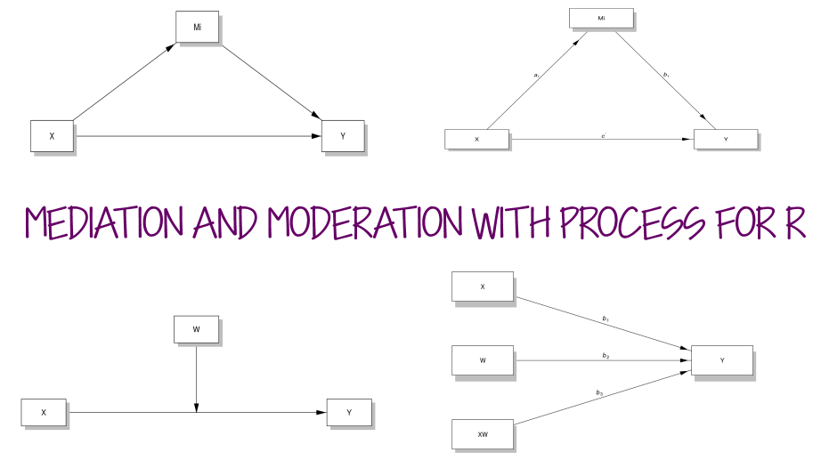

```{r setup, include=FALSE}
knitr::opts_chunk$set(echo = FALSE, warning = F)

library(learnr)
library(tidyverse)
library(processR)
library(haven)
library(readxl)
library(fontawesome)

#datasets
ex1data <- read.csv("data/ex1data.csv")
tvability <- read_excel("data/keith tv ability.xls")
source("process.R", local = knitr::knit_global())

```

## Getting Started

```{r, echo=FALSE, out.width="75%", fig.align = "center"}
  
```


PROCESS was developed by Andrew Hayes in conjunction with the book [**Introduction to Mediation, Moderation, and Conditional Process Analysis**](https://www.guilford.com/books/Introduction-to-Mediation-Moderation-and-Conditional-Process-Analysis/Andrew-Hayes/9781462549030). The book is about to be in its 3rd edition. The citation for the 2nd edition of the book is in the syllabus for RS 932. 

PROCESS was originally developed for SPSS, and is now also available for SAS and R.  In this tutorial, you'll learn how to use PROCESS to run mediation and moderation models. 

There are two ways you can run PROCESS in R.  Andrew Hayes released an R script with version 3.5 of the PROCESS macro. You can download it [here](https://www.processmacro.org/download.html) (the file will contain the SPSS and SAS macros as well).    

## PROCESS R Script

Once you have downloaded PROCESS from the website, you can open the script file ("process.R").  Note that is a script file and not a package.  When you want to use PROCESS, you will need to run the script file first. The script is huge, so it takes a couple of minutes for it to load (depending on how fast your computer is).  Once the script is loaded, you will get the following message:

```{r, echo=FALSE, out.width="75%", fig.align = "center"}
knitr::include_graphics("images/process-script-msg.png")  
```

You will also see the PROCESS function in your Environment under "Functions".  

### Running PROCESS: Mediation

The Appendix for [**Introduction to Mediation, Moderation, and Conditional Process Analysis**](https://www.guilford.com/books/Introduction-to-Mediation-Moderation-and-Conditional-Process-Analysis/Andrew-Hayes/9781462549030) contains figures for every type of model that can be run with PROCESS. There are more than 70 that vary from the very simple to the very complex.  For this example, we will use Model 4, which is a simple mediation model with one mediator.  The conceptual model for this figure looks like this:

```{r}
processR::pmacroModel(4)
```

We'll use the data from Chapter 11 of the Keith book that examines whether motivation mediates the relationship between ability and achievement.  Here is the model with the variable names included:

```{r}
labels=list(X="ability",M="motivation",Y="achievement")
processR::pmacroModel(4,labels=labels)
```

A few things to take care of before you run the model with the process script:

1.  Make sure all missing data is coded as NA
2.  Make sure all data is numeric.  If you have a categorical moderator that is factored in R, you'll need to convert to numeric format.
3.  Include `progress = 0` in your `process` code so that you don't get a progress completion bar for bootstrapping in your output (not sure why this was included...you don't need it). Bootstrapping takes some time. Be patient. The results will appear when bootstrapping is complete.  


`r fa("fas fa-laptop-code", fill= "purple")` **CODING EXAMPLE** 

To run a simple mediation model, we need to specify the data file, and then each piece of the model (x, m, y), with variable names in quotation marks.  We also need to specify which model we would like to use (in this case, `model = 4`). 

```{r process-ex1, echo=TRUE}
process(data=ex1data,y="achieve",x="ability",m="motivate",model=4, progress = 0)
```

`r fa("fas fa-laptop-code", fill= "purple")` **CODING EXERCISE**

There are a few other variables in the `ex1data` data frame that we can use to examine mediation models.  Use `process` to determine whether coursework (`course`) mediates the relationship between family background (`fam_back`) and achievement (`achieve`).

```{r process-exercise-1, exercise = TRUE}

```

```{r process-exercise-1-hint}
process(data = dataset, x = "IV", m = "mediator", "y = DV", model = 4, progress = 0)
```

```{r process-exercise-1-solution}
process(data = ex1data, x = "fam_back", m = "course", y = "achieve", model = 4, progress = 0)
```

### Running PROCESS: Moderation

Running a simple (one moderator) moderation model is also fairly straightforward, and follows the same coding syntax that we used for mediation, with a few changes:

1.  Instead of `m = mediator` we will instead use `w = moderator`.  
2.  We need to change the model number to `model = 1`. 
3.  We can request the Johnson-Neyman regions of significance using `jn=1`. 
4.  We can have `process` automatically apply centering to the predictor and moderator with `center=1`. 


We'll return to the moderation example from Chapter 8 of the Keith book:  Does a child's ability level moderate the relationship between tv viewing and achievement?  The `tvability` dataset has been pre-loaded.  Let's run the model!


```{r process-moderation, echo=TRUE}
process(data = tvability, x = "TV", w = "ABILITY", y = "ACHIEVE", model = 1, progress = 0, jn=1, center=1)
```


While the `process` script mimics what you would get via SPSS, it doesn't really take advantage of many of the benefits of running analyses in R. The documentation is pretty sparse for the R version, and the book appendices just instruct you to adapt the code from SAS.  If you really want to (or for some reason, need to) use PROCESS, you may be better off just pulling your data into SPSS, installing the SPSS PROCESS macro, and running your analysis there.

The next section of this tutorial will show you how to use this package, called `processR`.  This package is not created or endorsed by Andrew Hayes. Because the package is fairly new and the documentation leaves a lot to be desired, I'd only recommend using it for graphical purposes at this point.  But it does create nice figures and can help you visualize your models.  If and when the documentation improves, then it may be a good option for running mediation/moderation models in R.

## `processR`

The `processR` package is a new package developed by Keon-Woong Moon. Install the package using `install.packages` function.  

```{r, echo = TRUE, eval= FALSE}
install.packages("processR")
```

You can find documentation for the package [HERE](https://cran.r-project.org/web/packages/processR/processR.pdf), and the vignette for the package [HERE](https://cran.r-project.org/web/packages/processR/vignettes/processR.html).  

There is also an RPubs page with a demonstration of how to use `processR` [HERE](https://rpubs.com/cardiomoon/468600)


#### Model Figures

`processR` will create a figure for 57 different types of PROCESS models. Model numbers correspond to those in the appendix of the Hayes book.  

Here is the code and figure for a simple mediation model:

```{r figure-ex, echo=TRUE}
processR::pmacroModel(4)
```


You can also add labels to figure.

```{r echo=TRUE}
labels=list(X="fam_back",M="motivation",Y="achieve")
processR::pmacroModel(4,labels = labels)
```

To get a statistical diagram that includes path names, use `statisticalDiagram(model#)`

```{r echo=T}
processR::statisticalDiagram(4,labels = labels)
```
