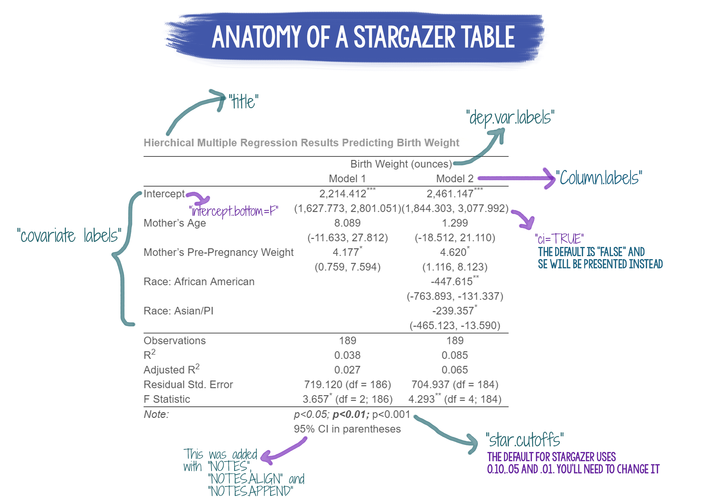

```{r setup, include=FALSE}

library(haven)
library(learnr)
library(tidyverse)
library(fontawesome)
library(car)
library(carData)
library(stargazer)

knitr::opts_chunk$set(echo = FALSE)

data(attitude) 
model.1 <- lm(rating ~ complaints + privileges + learning + raises, data = attitude)

birth_data <- read_sav("data/birthweight.sav")
birth_data <- birth_data %>%
  dplyr::mutate(across(c(moms_race, moms_smoking, hypertension, Uterine_irrit),as_factor))

mr_model1 <- lm(birthwt ~ moms_age + moms_nl_wt, data = birth_data)
mr_model2 <- lm(birthwt ~ moms_age + moms_nl_wt + moms_race, data = birth_data)

```


## Introduction

<br>

`r fa("fas fa-chalkboard-teacher", fill = "purple")`**LEARNING OBJECTIVES**

::: {.tip}
The **objectives** of this tutorial are:

-   Effectively communicate the results of different types of regression models in APA format
-   Identify and report the key elements of a regression model to include in the results section
-   Understand when and how to use tables to effectively report regression results
-   Learn to correctly use APA formatting for the reporting of results in a journal manuscript
:::

------------------------------------------------------------------------

`r fa("fab fa-r-project", fill = "purple")` **GOALS** 

::: {.tip}
In this tutorial, you will learn how to:

-   Use the `broom` package to create `tidy` dataframes/tibbles of your results
-   Use the `stargazer` package to create tables of regression results for both simultaneous and hierarchical models.
:::

------------------------------------------------------------------------

## Stargazer Package

```{r, echo=FALSE, out.width="75%", fig.align = "center"}
  
```

The `stargazer` package was developed to translate model results into tables that can be displayed via text, latex, or html.  `stargazer` can also provide a table of descriptive statistics for a data frame.  The tables that are created are publication quality, and will require very little tweaking to be manuscript-ready. The video below (~20 minutes) will demonstrate how to use the `stargazer` package and uses the same examples described further in this tutorial.


### Documentation for `stargazer`

To download and install the package:

```{r, echo=TRUE, eval=FALSE}
install.packages("stargazer")
library(stargazer)
```

<br>

To access the reference manual for the package from CRAN: [stargazer reference manual](https://cran.r-project.org/web/packages/stargazer/stargazer.pdf)
<br>
You can find the vignette for `stargazer`  here:   [Stargazer Vignette](https://cran.r-project.org/web/packages/stargazer/vignettes/stargazer.pdf)

<br>

**Helpful Websites for `stargazer` :**

1.  [Jake Russ page for `stargazer`](https://www.jakeruss.com/cheatsheets/stargazer/)

2.  [Northeaster University/Econ Press Page](https://web.northeastern.edu/econpress/wp-content/uploads/2016/04/Stargazer.pdf)  


<br>
<br>

### Why Use `stargazer` ? 

There are several benefits to using `stargazer` (or any other package that automatically creates tables of your results):

*  Once you set it up the code for your model, if your model or data changes, you do not have to re-create the table from scratch.  You can update your model results and then re-run the code to create the table.  Time saver!

*  Using a package to table your results is more efficient because you aren't having to re-type your results in a new document/table
    
*  Decreases the likelihood of transcription errors because R is doing the work for you 


### Tips for Using `stargazer`

Whenever you use `stargazer`, you need to make sure to do two things:

  1.  In the chunk heading, add the statement `results = "asis"`.  Without this piece of information, stargazer tables will not knit correctly.  
  
  2.  Set the `type` to either `type = "html"` or `type = "text"`.  By default, `stargazer` is set to `type = latex`, but we won't be using latex for our purposes so you need to change this setting.  If you are looking at your tables in RMarkdown, set it to "text". If you are knitting, change it to `html` and be sure to knit to an html file format.  


<br>


### Descriptive Statistics 

We can use one of the built-in datasets to show how to get a table of descriptives. The `attitude` dataset has been loaded. By default, when given a dataset name, `stargazer` will output a table of descriptive statistics.  

<br>

```{r, stargazer-descriptives, results = "asis", echo = T}
data(attitude)
library(stargazer)
stargazer(attitude, type = "html")
```

<br>
<br>

### Regression Tables

You can feed linear, generalized linear, logistic, and multilevel models (as well as several other types of models) into `stargazer` to create a table. Even better, you can include multiple models and different model types in the same table!  

<br>


**Coding Example 1**

In this first example, we'll use `stargazer` to report the results of a simultaneous linear regression model. We are once again using the `attitude` dataset. This model looks at whether workplace factors such as the number of complaints, privileges, learning opportunities, and raises influence employee ratings of the organization.  


```{r coding-example-1, results = "asis", echo = TRUE}

model.1 <- lm(rating ~ complaints + privileges + learning + raises, data = attitude)

stargazer(model.1, 
          type = "html")
```

<br>
<br>

This table needs a bit of work to be publication-ready. A few things that we should change:

1. Move the intercept to the top of the table instead of the bottom.  We can do that by adding `intercept.bottom = FALSE`.

2.  Change the star cut-offs for the p-values.  We want .05, .01, and .001.  To do that, use `star.cutoffs = c(.05, .01, .001)`.

3.  Add a descriptive title with `title = "Give me a good title"`).  


Here is what the updated table looks like:

<br> 


```{r stargazer-updated, results = "asis", echo=TRUE, message = F, warning = F}
stargazer(model.1, 
          type = "html",
          title = "Sample Regression Table Using Stargazer Package",
          intercept.bottom = FALSE,
          star.cutoffs = c(.05,.01,.001))
```

<br>

Almost there. We can remove the "Dependent Variable" caption that appears above the name of the dependent variable ("rating").  We should also capitalize "rating" as well as the predictor variable names, and change "Constant" to "Intercept".  Be careful when editing the predictor variable names--they need to appear in the same order that you have them entered in the regression, and you need to account for the intercept (whether it appears at the top or the bottom).

```{r stargazer-updated-2, results = "asis", echo = TRUE}
stargazer(model.1, 
          type = "html",
          title = "Sample Regression Table Using Stargazer Package",
          intercept.bottom = FALSE,
          star.cutoffs = c(.05,.01,.001),
          dep.var.caption = "",  #removes the "Dependent Variable" label
          dep.var.labels = "Rating",  
          covariate.labels = c("Intercept", "Complaints", "Privileges", "Learning", "Raises"))
```

<br>

Looks great! Let's take a look at an example with multiple models presented in the same table.

<br>

<br>

**Coding Example 2**

In this example, we will present the results of a hierarchical regression model (2 step model). The first model is called `'mr_model1` and the second is `mr_model2`.  With this table, we have added column labels (`column.labels = c("Model 1", "Model 2"))`, covariate labels (`covariate.labels = `), turned off the dependent label caption `dep.var.caption = ""`, and added a dependent variable label (`dep.var.labels`).  We've also modified the table notes (`notes`, `notes.append`, and `notes.align`.)  

To see additional ways in which you can customize a stargazer table, check out the Jake Russ page (linked above).

```{r, results="asis", echo = T, eval= T}

stargazer(mr_model1, mr_model2,
          title = "Hierchical Multiple Regression Results Predicting Birth Weight",
          column.labels = c("Model 1", "Model 2"),
          model.numbers = F,
          intercept.bottom = FALSE,
          covariate.labels = c("Intercept", "Mother's Age", "Mother's Pre-Pregnancy Weight", 
                               "Race: African American", "Race: Asian/PI"),
          dep.var.caption = "",
          dep.var.labels = "Birth Weight (ounces)",
          type= "html", 
          ci = TRUE,
          star.cutoffs = c(0.05, 0.01, 0.001),
          notes = "95% CI in parentheses",
          notes.append = TRUE,
          notes.align = "l")
          
```

#### Exporting Tables from `stargazer`

While you can knit your RMD into an html or word document and copy tables from there, sometimes it might be easier to just export the table after you create it.  To export a table from `stargazer`, you need to add `out = "filename.html" to your code for the table.  Tables can be exported to text or html format. The exported table will be saved in your working directory (or where you tell R you want to save the file using a file location in the name).  

Tables exported as html files can be opened in MS Word and edited/adjusted.  

```{r stargazer-export, results = "asis", eval= FALSE}

stargazer(model.1, 
          type = "html",
          title = "Sample Regression Table Using Stargazer Package",
          intercept.bottom = FALSE,
          star.cutoffs = c(.05,.01,.001),
          out = "sampletable.html")
```


### Citing `stargazer`

If you use `stargazer` to create tables for your model results, you should include the citation for the package.

Hlavac, Marek (2018).  stargazer:  Well-Formatted Regression and Summary StatisticsTables.  R package version 5.2.2. https://CRAN.R-project.org/package=stargazer 


## APA Formatting
In general, follow the formatting guidelines described in the 7th edition of the *Publication Manual of the American Psychological Association* (2020) for preparing your manuscripts and reporting results. APA formatting is used by many journals, and other than how references are formated, APA styles shares a lot in common with other publication styles (so it is easy to adapt if you submit to a journal that does not use APA-style).  

#### Statistics to Report

These are general guidelines on what you should report for each type of regression model below. What you end up reporting in the text versus a table will depend on your research question(s), the number of predictors, how many models you ran and are reporting, and space available for text and/or tables.  One guiding principle to keep in mind when reporting results is whether a researcher conducting a meta-analysis would have everything they need in either the text, tables, or supplemental materials.  

-  **Overall regression model:**  *F* with degrees of freedom, *p*, $R^2$, $\Delta R^2$ (for hierarchical models)

-  **Predictors:**  *b* or $\beta$, *t* with degrees of freedom, 95%CI, *p*, and an effect size ($pr^2$ or $sr^2$)

Whether you put the results in the text, table, or some combination of the two, you should only report statistics in one place. Do not fully describe the results in the text and then also present a table with those same numbers. The exception to this rule is p-values and effect sizes, which you can present in two places (and use to facilitate a description of the tabled results in the text).


**Simultaneous Regression**
In the text, report  the overall F with degrees of freedom, p-value, and $R^2$.  If there are 3 or fewer predictors, you can describe the results of those predictors in the text, reporting b (or beta),SE, t with df, p-value, and semi-partial or partial $r^2$, and the 95% CI for the predictor.  With more than 3 predictors, you are probably better off reporting a full regression results table that includes all of the statistics listed above.  If you table your results, in the text you should summarize the major findings by describing statistically significant findings and reporting just the p-values for the predictors.    

**Hierarchical Regression**
In the data analysis section, describe which variables will be included at each step of the regression. In the Results text, for the 1st step of the model report the F with degrees of freedom, p-value, and $R^2$. If you only have one or two predictors, you can go ahead and report and interpret those next as you would if it was a simultaneous regression.  

For the subsequent steps of the model, report the $\Delta R^2$ and whether that change was statistically significant ($\Delta$ *F*, df, *p*). Then interpret the predictors that were entered on that step (but not the ones previously entered).  Continue this pattern for each step of the regression.   

With several predictors or several steps, you may be better off putting everything in one table and just describing the results in the text, supplementing with p-values and effect sizes, as appropriate.    


#### Decimal places

Use one decimal place for:

  -  Percentages

Use two decimal places for:

  -  Descriptive statistics (*M*, *SD*)
  
  -  Correlations (*r*)
  
  -  Inferential statistics (*t*, *F*, *p*, *b*, *SE*)

Use three decimal place for:

  -  When you have p-values that are <.001, report as *p<.001*
  
  -  When there is a need for precision because of the nature of the data (e.g., you don't want to report a table
  of results of "0.00" if the results are all between 0.001 and 0.004)

#### Leading zeros

  -  If the number you are reporting can never exceed 1, you do not use a leading 0.
  
  -  If the number you are reporting can exceed 1, use a leading 0. 

#### Italics and Capitalization

You should italicize:

   -  descriptive and inferential statistics (e.g., *M*, *SD*, *t*, *F*, *p*, *b*, *SE*, *d*, *$R^2$*, *r*)
   
   - *n* for samples and *N* for population statistics

You should capitalize and italicize:
  
  -  *M*, *SD*, *F*, *SE*, $R^2$ 

#### Other APA style tips

-  Put spaces in front of and behind the "=" whenever it is used  (e.g.,  *M* = 5.56  not *M*=5.6)

-  Degrees of freedom go in parentheses next to the statistic they are accompanying (e.g., *F*(1,35) = 4.56)

-  Confidence intervals go in [ ] and lower and upper limits are separated by a "," (e.g., 95%CI[0.45, 1.25])

-  Report exact p-values, except when *p* is less than .001. In that instance, report *p*<.001.  Do not report   *p*=.000 or *p* = .00.
