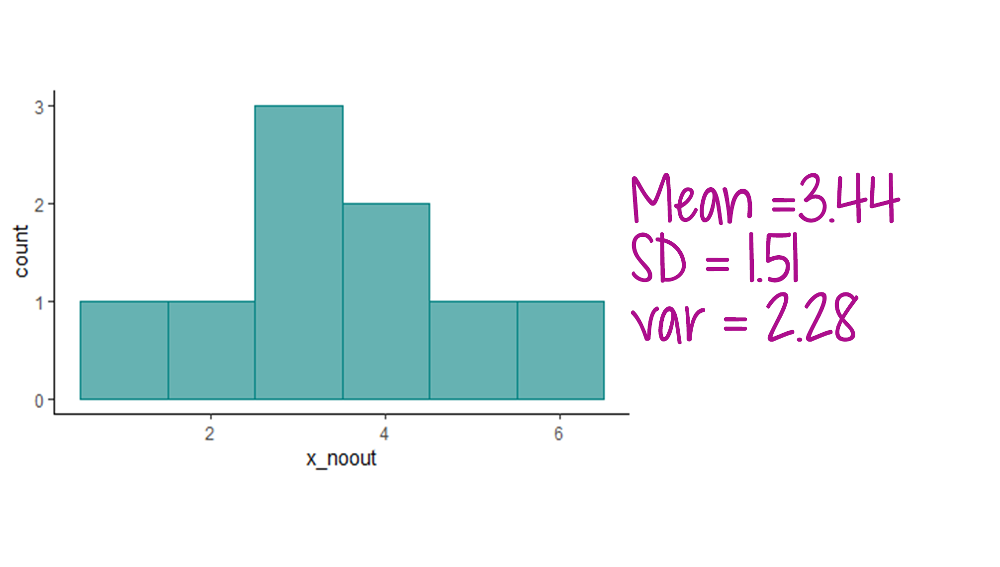

```{r setup, include=FALSE}

library(learnr)
library(tidyverse)
library(psych)
library(fontawesome)
library(WRS2)
library(robustbase)
library(parameters)

knitr::opts_chunk$set(echo = FALSE)

#datasets
data(sat.act)
describe(sat.act)

sat.act.temp <- sat.act %>%
  select(education:SATQ) %>%
  na.omit()

mahal_cutoff = qchisq(1-.001, ncol(sat.act.temp))
mahal = mahalanobis(sat.act.temp,
                    colMeans(sat.act.temp),
                    cov(sat.act.temp))
badmahal = as.numeric(mahal > mahal_cutoff) 

regular_model <-lm(SATQ ~ SATV+ age + gender, data = sat.act)
robust_model <- lmrob(SATQ ~ SATV + age + gender , data = sat.act)
```

## Screening for Outliers

Much of the inferential statistical methods we use center around the assumption of normality. However, real data are messy! Your data is likely to be skewed or contain one or more outliers. This can affect measures of central tendency, as well as model estimates.

There are two types of outliers we will discuss:  **Univariate Outliers** and **Multivariate Outliers**

### Univariate Outliers

A univariate outlier is a data point that represents an extreme value in the dataset, often more than 3 standard deviations away from the mean. Sometimes, these values represent cases that are not part of the population you are interested in studying. Other times, they are perfectly valid data points that just happen to be in the "tails" of a distribution (remember, there are scores in the tails of a normal distribution!).

The best way to identify outliers is with visualization via a histogram or boxplot.  


Here's an example:

```{r, echo=FALSE, eval=FALSE}
x <- c(1,3,2,4,3,5,3,4,6,12)
x_Data <-data.frame(x=x)
mean(x)
median(x)
sd(x)

library(ggplot2)
ggplot2::ggplot(x_Data, aes(x=x)) +
  geom_histogram(binwidth=1, color = "#008080", fill="#66b2b2") +
    theme(panel.grid.major = element_blank(), 
        panel.grid.minor = element_blank(),
        panel.background = element_blank(), 
        axis.line = element_line(colour = "black"))
```

```{r, echo=FALSE, out.width="75%", fig.align = "center"}
knitr::include_graphics("images/outlier.png")  
```

In the histogram above, there is an outlier that is inflating the mean. If that value is removed from the dataset and then the descriptive statistics recalculated, you can see how that outlier's effect.


```{r regraph, echo=F, eval = FALSE}
x_noout <- c(1,3,2,4,3,5,3,4,6)
x_Data_noout <-data.frame(x=x_noout)

var(x_noout)
ggplot2::ggplot(x_Data_noout, aes(x=x_noout)) +
  geom_histogram(binwidth=1, color = "#008080", fill="#66b2b2") +
    theme(panel.grid.major = element_blank(), 
        panel.grid.minor = element_blank(),
        panel.background = element_blank(), 
        axis.line = element_line(colour = "black"))
```

```{r, echo=FALSE, out.width="75%", fig.align = "center"}
  
```


***


### Multivariate Outliers

Multivariate outliers are cases that have extreme or unusual values on more than one variable, or a combination of variables. These outliers can also affect descriptive statistics and model estimates.  While visualization (and z-scores) can be used for detecting univariate outliers, it is less useful for multivariate outliers.  Instead, we use **Mahalanobis Distances** to identify multivariate outliers.  


#### Mahalanobis Distance (MD)

What is **Mahalanobis distance**?  It is a multivariate statistic that represents the distance between a point and a distribution.  


*   **Overly simplistic definition**: Measure of the distance of a case from the mean of the predictor variables

*   **More complicated definition**:  Measure of the distance between a case and the centroid of the multivariate space

After calculating Mahalanobis distances for each case in your dataset, you can calculate a cut-off score based on the number of predictors in the dataset (those included in the MD calculation).  If a case's MD score exceeds the cut-off, you can consider that case a multivariate outlier.  

The test statistic has a Chi-square distribution with degrees of freedom equal to the # of predictors in the model.


**When calculating Mahalanobis distances in R, make sure to do the following:**

*  Take care of any missing data. The `mahalanobis` function will not work on datasets with NAs.

*  Remove or exclude the ID variable

*  Remove or exclude any categorical variables.

*  Remove or exclude any standardized variables you've calculated/added to the data frame.


You can create a temporary dataset to accomplish the above, or you can write code within the function that will exclude those variables.  You can tell R to exclude the ID column and any categorical columns using `datasetname[,-1]`, replacing the `-1` with the column number or numbers you want to exclude (or, only put the column numbers that you want used). This code would exclude the first column of the dataset (so you can adapt it for your own purposes). Example code below shows how to use each of these strategies.  

We will return to the `sat.act` dataset from the `psych` package to demonstrate how to calculate MDs.  

**`r fa("fas fa-laptop-code", fill = "teal")` Coding Example**

##### Method 1: Calculating MDs with a temporary dataset

The first step will be to create a temporary dataset that does not have any missing data, and only includes continuous variables (e.g., excludes ID, categorical variables, z-scores).  

```{r temp-dataset, echo=TRUE}
sat.act.temp <- sat.act %>%
  select(education:SATQ) %>%
  na.omit()
```

Next, use the `mahalanobis` function to calculate the MDs.

```{r mahal-method1, echo=TRUE}
mahal = mahalanobis(sat.act.temp,
                    colMeans(sat.act.temp),
                    cov(sat.act.temp))
```

##### Method 2: Calculate MDs excluding variables in the same code chunk
For this method, we still need to get rid of missing data first. We'll create a no-missing dataset, and then run the MD calculation. This time, we will use the `[]` to exclude the ID variable and categorical variables/z-scores in the dataframe.

```{r method-2, echo=TRUE}

sat.act.nomiss <- sat.act %>%
  na.omit()

mahal2 = mahalanobis(sat.act.nomiss[, -c(1, 7:10)],
                    colMeans(sat.act.nomiss[, -c(1, 7:10)]),
                    cov(sat.act.nomiss[, -c(1, 7:10)]))
```

Regardless of what method you use, the next step is to figure out how many cases exceed the cut-off value.  

We calculate the cutoff first, then determine how many cases exceed that cutoff.  The cut-off value is based on a chi-square distribution with degrees of freedom equal to the number of variables included in the analysis.  We want to know if the mahalanobis values we calculate for each case in the dataset exceed a threshold of *p*<.001 (i.e., more extreme than .001).  

We can then create a table that tells us how many cases in the dataset have "bad" mahalanobis values.

```{r mahal-cutoff, exercise = TRUE}
mahal_cutoff = qchisq(1-.001, ncol(sat.act.temp))
badmahal = as.numeric(mahal > mahal_cutoff) 
table(badmahal)
```

We end up with 11 cases that exceed the cut-off of p<.001. We can use the `which` function to figure out which specific cases have been labeled as having a bad mahalanobis distance.  Later on, we will combine Mahalanobis distance findings with other regression diagnostics to identify "bad" cases. For now, we will leave these cases in the dataset and proceed cautiously. 

```{r which-fun, exercise=TRUE}
which(badmahal==1)
```


## What to do with Outliers

```{r, echo=FALSE, out.width="75%", fig.align = "center"}
knitr::include_graphics("images/outliertodo.png")  
```

Once you have identified outliers, you have some options on how to proceed.  


1.  **Ignore it**.  Sometimes this is actually okay, especially if you have a large dataset and only 1-2 outliers that are not especially influential. Optimistically proceed with your analytic plan as if everything was just as you imagined it :-)   

2.  **Remove it!**  You can delete the outliers.  If you go this route, you need to establish a rule *before* data analyses on which cases will be removed.  The 3 SDs from the mean rule is probably one that is used the most often, but you may decide to be more or less conservative.

3.  **Trim it!** Trim a proportion of the data from each end of the distribution and take the mean of the remaining values. 

4.  **Winsorize it!**  Replace a proportion of the data at each end of the distribution with the next closest observation and then calculate the mean. This typically means taking the top and bottom 10% of values and replacing them with the next closest observation.  

So option #1 essentially ignores the issue, and Options #2-4 have you deleting data that you likely worked very hard to collect!  So if none of these options is wholly satisfying, you may be left wondering what to do.  

Luckily, you also have hidden option #5: Robust Statistics!  


## What are Robust Statistics?

```{r, echo=FALSE, out.width="75%", fig.align = "center"}
knitr::include_graphics("images/robust.png")  
```

Robust statistical methods de-weight outliers so cases do not have to be excluded. They relax the assumptions of the general linear model to allow you to leverage your full dataset.  

In the next section, you'll learn how to use R to calculate trimmed and winsorized descriptive statistics.

***


## Robust Descriptive Statistics in R

To calculate robust descriptive statistics, we will use the `sat.act` dataset that accompanies the `psych` package.  Load the dataset into your environment, then use `psych::describe` to request descriptive statistics for the whole data frame. 

##### **`r fa("fas fa-laptop-code", fill = "teal")` Coding Exercise** 

```{r load-and-describe, exercise = TRUE}
library(psych)
data(sat.act)
psych::describe(sat.act, IQR=TRUE)
```


The output for `describe` includes standard descriptive statistics, as well as the trimmed mean. The default is to trim by 10%.  If you want to change it, you can add `trim = .2` (or whatever percentage you need) to the call to `describe`.


##### **`r fa("fas fa-laptop-code", fill = "teal")` Coding Exercise** 

Modify the code below to trim 20% of the data.

```{r adjusting-trim, exercise = TRUE}
psych::describe(sat.act, IQR=TRUE)
```

```{r adjusting-trim-solution}
psych::describe(sat.act, trim = .2, IQR=TRUE)
```


We can also use the `psych` package to get the winsorized means, standard deviations, and variances for variables.  In the code below, a new variable called `ACT_wins` is created that represents the winsorized mean.  

```{r winsorized-mean, echo=TRUE}

sat.act <- sat.act %>%
  mutate(ACT_wins = psych::winsor(ACT, trim = 0.2, na.rm = TRUE))
```

We can also use the `psych` package to get the winsorized variance and standard deviation:

```{r winsor-sd-var, echo=TRUE}

psych::winsor.sd(sat.act$ACT, trim = 0.2, na.rm = TRUE)  

psych::winsor.var(sat.act$ACT, trim = 0.2, na.rm = TRUE) 

```


::: {.tip}
**QUESTION** What do you notice about the trimmed means and winsorized means compared to the original means? Are they similar? Different? How different?
:::


## Robust T-test

The t-test is part of the general linear model--it is a statistical test that allows you to determine if two means are significantly different from one another. Because it is part of the GLM, there are several assumptions that need to be met, including normality and homogeneity of variances.  When those assumptions are violated, you can use a robust version of the t-test that does not require meeting those assumptions. 


```{r, echo=FALSE, out.width="75%", fig.align = "center"}
knitr::include_graphics("images/ttestoptions.png")  
```

##### **`r fa("fas fa-laptop-code", fill = "teal")` Coding Exercise** 

Conducting a Welch t-test is fairly straightforward.  Modify your usual t-test code with `equal.variances = FALSE`.


```{r welch-t, exercise = TRUE}

t.test(SATV ~ gender, data = sat.act, equal.variances = FALSE)
```

The output is labeled `Welch Two Sample t-test`.  The t-statistic is not statistically significant, *p* = .62.

To run a Yuen t-test, you need to have the `WRS2` library installed.  After loading the library, the code to run the t-test is very similar to a Welch t-test. Because the Yuen t-test uses trimmed means, you can adjust the percentage of data that is trimmed.  Run the code below as is, and then re-run it and change `tr = .2` to `tr = .1`.  Then compare the results.

```{r yuen-t, exercise = TRUE}
WRS2::yuen(SATV ~ gender, data = sat.act, tr = .2, alpha = .05)
```

## Robust Regression

Robust regression is a regression modeling strategy that is not limited by the assumptions of the general linear model.  It is useful when you have outliers and influential cases because it applies weights to cases. Outliers are de-weighted to decrease or limit the impact they have on the overall model.  

Install the `robustbase` package and then load the library. The code for running robust regression is nearly identical to that for linear regression.  Just change the `lm` to `lmrob`.  


##### **`r fa("fas fa-laptop-code", fill = "teal")` Coding Exercise** 

Run the two regression models below and compare the results.

```{r robust-regression, exercise = TRUE}

library(robustbase)

regular_model <-lm(SATQ ~ SATV+ age + gender, data = sat.act)
summary(regular_model)

robust_model <- lmrob(SATQ ~ SATV + age + gender , data = sat.act)
summary(robust_model)

```


## Bootstrapping

Bootstrapping is a procedure where you resample over and over again (thousands of times) from your original sample,  creating a new sampling distribution.  Essentially, you are treating your sample as it was the population, and then resampling from it over and over again. You can then calculate statistics or run a model on each of your bootstrapped samples, as well as average across them. Bootstrapping does not make any distributional assumptions about the data. In the context of a regression model, we may benefit from bootstrapping the standard errors and confidence intervals, as doing so may lead to more accurate conclusions about the population under investigation.  Bootstrapping can be useful when you have small samples, although it is not a "cure all" solution to not having enough data. 

The `parameters` package has a bootstrapping function you can apply to your model results.

```{r bootstrap, exercise = TRUE}
parameters::model_parameters(regular_model, bootstrap = TRUE, digits = 3)
```


